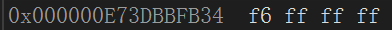

# int类型在内存中的存储

```c
	int a = 20;
    /*
        因为负数在内存中存储的是补码，所以转换一下
        10000000000000000000000000001010 - 原码
        11111111111111111111111111110101 - 反
        1111 1111 1111 1111 1111 1111 1111 0110 - 补
        因为内存是已十六进制显示，转换结果为
        ff ff ff f6

    */
	int b = -10;
```



> [内存存储的十六进制为什么倒着存请参考**大端小端**](#大端小端)

---

## 为什么内存存储补码呢

> 在计算机系统中,数值一律用补码来表示和存储。原因在于,使用补码,可以将符号位和数值域统一处理，同时，加法和减法也可以统一处理 ( CPU只有加法器)此外,补码与原码相互转换,其运算过程是相同的.不需要额外的硬件电路。

```c
    /*
        如果是原码相加的话数值就有问题。
        补码相加
        00000000000000000000000000000001
        11111111111111111111111111111111 - -1的补码
        10000000000000000000000000000000 - 超出的位丢掉
        result: 00000000000000000000000000000000
    */
    1 + (-1)
```

---

# float类型在内存中的存储

`计算标准: (-1)^S * M * 2^E`

- S符号位用来表示正负号，0表示正数，1表示负数
- M尾数位表示使用了科学计数法之后的值(值在1<= M <2之间),所以在存储时只把小数存进去，读取时在补上去
- E指数位用来表示浮点数的指数部分，采用偏移码表示

```c
    /*
    例: 9.0 -- 十进制
    转换为二进制 => 1001.0 -- 小数点后的数按2的负数次方计算，因为0的多少次方都是0所以直接放在后面
    计算标准: (-1)^S * M * 2^E(symbol)
    S表示数值的正负 1为负 0为正
    M表示使用了科学计数法之后的值
    E表示移位多少例如现在就是 1001.0 ==> 1.001 * 10^3 这里的3就代表着E
    (-1)^0 * 1.001 * 2^3
    S = 0
    M = 1.001
    E = 3

    但是因为E并不总是为正数的，所以为了解决这个问题实际指数加上一个偏移值（127）来存储(32位)。
    */
    float i = 9.0;
    /*
		转换为二进制 => 101.1  
		-1^0 * 1.011 * 2^2 ==> (-1)^S * M * 2^E
		S = 0; M = 1.011 E = 2
		但实际放在内存的E要保证是正数所以 + 127(32位)
		而M只把小数部分存进去，解析的时候会补上去
		最终 ==> 0 011 129 -- S占位1bit E占位8bit M占位23bit ,M往后补0
		0 10000001 011 00000000000000000000
		符号位 129转换为二进制 M的值不够补0
		因为内存是已十六进制显示
		0100 0000 1011 0000 0000 0000 0000 0000
		40 b0 00 00 --小端--> 00 00 b0 40
	*/
    float b = 5.5;

```

> [关于float类型存储详细请参考`float类型在内存中的存储详细`](./show_detail/detail.md#float类型在内存中的存储详细)

---

# 大端小端

> 大端(存储)模式：表示数据的高位字节存储在低地址，低位字节存储在高地址，即数据的起始地址是最高有效字节。
> 
> 小端(存储)模式：则相反，数据的高位字节存储在高地址，低位字节存储在低地址，即数据的起始地址是最低有效字节。

```c
    /*
        利用程序判断大端小端
        1为小端，0为大端
    */
    int is_system()
    {
        int a = 1;
        /*
            指针类型决定了访问多少个字节
            而判断1这个整数的存储是大端还是小端，就需要拿到头一个字节的值
            所以放在了char*指针中
        */
        char* pc = (char*)&a;
        if(*pc == 1)
        {
            return 1;
        }
        else {
            return 0;
        }
    };

    int is_system() {
        int a = 1;
        return *(char*)&a;
    }
```

---

# 当函数无参数但使用时也传递参数时

```c
    #include <stdio.h>
    // void test()
    void test(void)//void表无类型
    {
        printf("hehehe\n");
    };
    int main()
    {
        /*
            当函数无参而传递参数时不会有什么，但是不想让他人传递参数可以+一个void
        */
        test(100);//warning C4087: “test”: 用“void”参数列表声明
        return 0;
    }
```

---

# 指针进阶

## 指针形式的终极奥义

arr[i] = *(arr + i) = *(pi + 1) = pi[i] 

```c
    int main()
    {
        int arr[3] = {1,2,3};
        //首元素地址
        int* pi = arr;
        int i = 0;
        for(i = 0; i < 3; i++)
        {
            //arr[i] = *(arr + i) = *(pi + 1) = pi[i] 
            // printf("%d ", *(arr + i));
            printf("%d ", pi[i]);
        }
    }
    
```

---

## 指针形式的绕口令

```c
    int arr[5]; // ===> 存储5个元素的整型数组
    int* arr[5];// ===> 存储5个(int*)指针的指针数组
    int(*arr)[5];// ===> 数组指针，指向的值类型int [5]

    /*
        ===> 一个存储数组指针的数组。
        拆分开为 ===> 1. arr[5]  2. int* [3]
        arr[5]是一个数组，存储的指针的类型为int* [3]
    */
    int (*arr[5])[3];

    int* (arr[5]) [3];
```

---

## 数组参数--指针参数

### 一维数组首元素地址作为参数

写法:`int* pi -- int arr[]`

```c
    #include <stdio.h>

    // void test(int arr[]) { //首元素地址
    void test(int* pi) { //首元素地址
        printf("hehe");
    };

    int main() {
        int arr[] = {1,2,3};
        test(arr);
        test(&arr[0]);
        return 0;
    };
```

---

### 一维指针数组首元素地址作为参数

写法:`char* arr[] -- char** arr`

```c
    // void test(char* arr[]) {
    void test(char** arr) {
        printf("hehe");
    }

    int main() {
        //把常量字符串的a的地址传递过去，其实还是传递首元素地址
        char* pc = "abcd";
        char* arr[] = { pc };
        /*
            这里的类型是char*是一个指针,而数组作为参数,传的是首元素地址
            在这里也就是指针的地址,所以用二级指针作为形参
        */
        test(arr);
        return 0;
    };
```

---

### 二维数组首元素地址作为参数

写法:`arr[][column] -- int (*arr)[column]`

```c
    // void test(arr[2][4]) {
    void test(int (*arr)[4]) {    
        printf("hehe");
    }

    int main() {
        /*
            二维数组的第一行也就是一个数组,
            所以传递首元素地址为一个数组
        */
        int arr[2][4] = { 0 };
        test(arr);
        return 1;
    }
```

> [关于二维数组的知识参考**二维数组**](./C语言学习.md#二维数组)

---

## 函数指针

```c
    int Add(int x, int y) {
        return x + y;
    };

    void Print(char* pc) {
        printf("%s\n", pc);
    };

    int main() {
        /*
            函数也是有地址的
        */
        int (*fun)(int, int) = Add;
        // int (*fun)(int x, int xiaozhupeiqi) = &Add;// 变量名可写可不写,也可以乱写
        printf("%d\n", (*fun)(1, 2));// 3
        printf("%p\n", Add);// Add 和 &Add功能一样
        printf("%p\n", &Add);
        void (*char_fun)(char*) = Print;
        /*
            在调用时char_fun前面的*没有用,可以不加,也可以一直加
            可以理解为函数Print就是一个地址,然后调用,而char_fun
            存储它的地址,所以可以直接(char_fun)("abcdefg");
        */
        (char_fun)("abcdefg");// abcdefg
        // (*char_fun)("abcdefg");// abcdefg
        // (**char_fun)("abcdefg");// abcdefg
        // (***char_fun)("abcdefg");// abcdefg
        return 0;
    }
```

---

### 函数指针的例题(面试题)

```c
    /*
        首先把0强制转换为函数指针类型 ===> (void(*)())0
        然后解引用 ===> *((void(*)())0)
        函数调用 ===> *((void(*)())0)()
        当然这个函数运行异常(面试题容易考)
    */
    *((void(*)())0)();
    /*
        1.*signal(int, void(*)(int)) ===> 这时还没有写返回值类型,这个函数指针
        有两个参数1.int 2.void(*)(int)函数指针
        它的返回值为void (int)也就是返回一个函数指针
        2.signal是一个函数声明
        signal函数的参数有2个,第一个是int,第二个是函数指针,该函数指针参数为int,返回值为void. signal函数返回值也是一个函数指针,该指针参数为int,返回值为void
    */
    void test(void (*signal(int, void(*)(int))) (int)) {};
    /*
        简化
    */
    typedef void(*)(int) func_int;
    func_int (signal(int, func_int));
```

---

## 函数指针的数组

语法格式:`type (*name[num])(...args)`

> 函数指针的数组的使用是一种**策略模式**
>
> [关于策略模式的详细请参考**策略模式详细**](./show_detail/detail.md#策略模式)

```c
int Add(int x, int y)
{
	return x + y;
}
int Subtract(int x, int y)
{
	return x - y;
}
int Multiplication(int x, int y)
{
	return x * y;
}
int Division(int x, int y)
{
	return x / y;
}

int main()
{
    int(*add)(int, int) = Add;
	int(*subtract)(int, int) = Subtract;
	int(*multiplication)(int, int) = Multiplication;
	int(*division)(int, int) = Division;
    //存放形式
	int(*arr[4])(int, int) = {add, subtract, multiplication, division};
    int i = 0;
    for(i = 0; i < 4; i++) {
        //因为函数名就是地址,可以直接调用
        arr[i](2,3)
    }
    return 0;
}
```

---

## 指向函数指针数组的指针

```c
    //函数指针数组
    int (*arr[5])(int, int) = { 0, Add ,Subtract,Div ,Mul };
    /*
        函数指针数组的指针
        int (* [5])(int, int) 为函数指针数组的类型
    */
    int(*(*pp_arr)[5])(int, int) = &arr;
    //如果能够正常使用,证明没有写错
    printf("%d\n", (*pp_arr)[1](1, 2));// 3
```

---

## 回调函数

> 回调函数不是自身调用.而是通过函数指针在特定条件下调用的函数.

```c
    void print() {
        printf("hehe");
    }
    void test(void (*pfunc)()) {
        pfunc();
    }

    int main() {
        test(print);
        return 0;
    }
```

> [更加贴近实际的应用请参考鹏哥C语言指针详细(5)](https://www.bilibili.com/video/BV1q54y1q79w/?p=36)

---

## void*类型

void*是一种指针类型，可以指向任何类型的数据(没警告)。

使用场景: 用来实现动态内存分配和**类型转换**等功能。

> 一般来说char\*指针存放int\*的地址,会出现`warning C4133: “初始化”: 从“int *”到“char *”的类型不兼容`. 那么想要这样的警告消失做法有:
>
>> 1. 强制类型转换`char* pc = (char*)&i;`
>> 2. 使用`void*`类型, 它可以存储所有指针地址,但有着一些注意点

### void*使用注意点

1. 无法使用解引用`*va = 1`, 因为根本不知道void*能够访问多少字节
2. 无法使用偏移元素`va++`, 因为根本不知道void*能够访问多少字节

```c
	int i = 0;
    void* va = &i;
	// *va = 0;//报错
	// va++;//报错
```

> [关于**类型转换**的使用场景请参考stdlib.h头文件中的`qsort()`](./C语言学习.md#qsort)