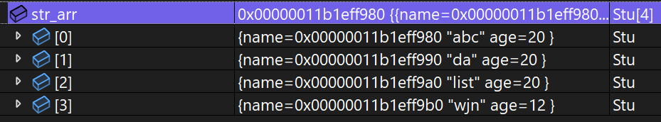

## scanf的注意点

*注意*：需要注意的是，`scanf`函数在**读取数据时会忽略空格(并且以空白字符输入而结束获取数据)、制表符和换行符等空白字符，直到读取到一个非空白字符为止**。因此，在读取多个数据时，需要按照格式控制字符串中的格式说明符的顺序依次输入数据，并确保输入的数据与格式控制字符串的格式相匹配，否则可能会导致程序出现错误。另外，scanf函数也存在一些安全问题，~~建议使用安全版本的`scanf`函数`scanf_s`来替代.~~


而且在visual studio编辑器中使用scanf输入函数会报错
> This function or variable may be unsafe. Consider using scanf_s instead. To disable deprecation, use _CRT_SECURE_NO_WARNINGS 
>
> 解决方法：
>   - 在顶部定义
>   - `#define _CRT_SECURE_NO_WARNINGS 1 //定义为其他数字的话，可能会导致编译器不再忽略这些警告信息，从而影响代码的编译和运行。`

*特别特别注意*: `scanf`函数为C语言提供而`scanf_s`函数为**VS编辑器**提供,他不是标准C语言提供的.(所以并没有跨平台性和移植性)

`#define`是一个预处理指令，用于定义宏常量或宏函数。定义的宏常量可以在代码中使用，将其替换为指定的值。注意: `#define定义的常量后面不加分号 ;`

`_CRT_SECURE_NO_WARNINGS`是一个宏常量，用于禁用一些与安全性相关的警告信息。当使用一些不安全的标准库函数（如`scanf`、`strcpy`等）时，编译器会发出警告，提示可能存在安全风险。通过定义`_CRT_SECURE_NO_WARNINGS`为1，可以禁用这些警告信息。

---

# float类型在内存中的存储详细

`计算标准: (-1)^S * M * 2^E`

> 根据IEEE754规定:对于**32位**的浮点数，最高位是符号位S，接着的8位是指数E，剩下的为有效数字M
>
> IEEE 754对有效数字M和指数E ,还有一些特别规定。前面说过， 1<= M <2 , 也就是说, M可以写成1. xxxxx的形式,其xxxxx表示小数部分。
>
> IEEE 754规定,在计算机内部保存M时，默认这个数的第一位总是1 ,因此可以被舍去,只保存后面的xxxx部分。比如保存1.01的时候,只保存01 ,等到读取的时候,再把第一位的1加上去。这样做的目的,是节省1位有效数字。以32位浮点数为例,留给M只有23位,将第一位的1舍去以后,等于可以保存24位有效数字
>
> 首先，E为一个无符号整数(unsigned int)这意味着,如果E为8位,它的取值范围为0-255 ;如果E为11位,它的取值范围为0- 2047.但是,我们知道,科学计数法中的E是可以出现负数的,所以EEE 754规定,存入内存时E的真实值必须再加上-一个中间数,对于8位的E ,这个中间数是127 ;对于11位的E ,这个中间数是1023.比如, 2/10的E是10 ,所以保存成32位浮点数时,必须保存成10+127=137 ,即10001001.

---

## E不全为0或1

这时,浮点数就采用下面的规则表示,即指数E的计算值减去127 (或1023) ,得到真实值,再将有效数字M前加上第一位的1。比如: 0.5(1/2)的二进制形式为0.1.由于规定正数部分必须为1 ,即将小数点右移1位，则为1.0 * 2^(-1),其阶码(E)为-1 +127=126.表示为01111110.而尾数1.0去掉整数部分为0 ,补齐0到23位000000000000000000 ,则其二进制表示形式为:0 01111110 00000000000000000000000.

```c
    /*
        反推：
        0 01111110 00000000000000000000000
        S(最高位) = 0
        M = 1.0 (将1补回来)
        E = 126 - 127 = -1(减127)
        整合还原 ==> m前移E位 === 0.1 ==> 二进制结果
        转换 ==> 0.5 S为0为正数
    */
```

---

## E全为0

这时,浮点数的指数E等于1-127(或者1-1023)即为真实值，有效数字M不再加上第一位的1,而是还原为0.xxxxx的小数。这样做是为了表示正负0 ,以及接近于0的很小的数字。

> 因为使E的进制为全为00000000，而且这还是加上127之后的结果，那么E的实际
> 
>结果就为-127.而1.xxxx * 2^(-127)这是一个非常大的数字,已知2^32已经有42亿多.再通过极限的定义1.xxxx * 2^(-127)是一个无限接近于0的数字(也可以间接性推断为什么浮点数被转换时精度会丢失). 所以特别规定了规则

---

## E全为1

这时,如果有效数字M全为0.表示无穷大 (正负取决于符号位s )

> 当E为全1时,即11111111 --转二--> 255 - 127 = 128. 而`1.xxx * 2^126`这又是一个很大的数,表示无穷大.

---

# 策略模式

> 在编程中，策略模式是一种设计模式，它允许在运行时选择算法的行为。它定义了一系列算法，将每个算法封装起来，并使它们可以互相替换。这样就可以在不改变使用算法的客户端代码的情况下，动态地选择算法。策略模式使得算法可以独立于客户端而变化，从而提高了代码的灵活性和可维护性.

js代码演示
```js
const handleType = {
    text(response) {//为response

        return response.toString();
    },
    json(response) {
        try {
            return JSON.parse(response);
        } catch (error) {
            //如果json转换除了问题进这里
            return response;
        }
    }
};
//按需引用
```

---

c代码演示
```c
int main()
{
	int input = 0;
	int x = 0;
	int y = 0;
    //加减乘除功能
	int (*arr[5])(int, int) = { 0, Add ,Subtract,Div ,Mul };
	do {
		printf("**********************\n");
		printf("***1.Add 2.Subtract***\n");
		printf("*****3.Div 4.Mul******\n");
		printf("******  0.exit  ******\n");
		scanf("%d", &input);
		if (input >= 1 && input <= 4)
		{
			printf("输入两个操作数进行运算\n");
			scanf("%d%d", &x, &y);
			printf("结果为:%d\n", arr[input](x, y));
		}
		else if (input == 0)
		{
			printf("已退出\n");
			break;
		}
		else {
			printf("选择错误\n");
		}
	} while (input);
	return 0;
}
```

---

# qsort()的使用

```c
#include <stdlib.h>
typedef struct Stu
{
	char name[20];
	int age;
}Stu;
/*
    qsort是一个通用的排序函数,而const void*的设计就可以保证传递的参数
    可以很好的被接收, 而在使用过程中通过强制类型转换得到自己需要的类型并使用
*/
int compare_struct(const void* a, const void* b)
{
    //通过结构体参数的年龄比较
	return (((Stu*)a) -> age - ((Stu*)b) -> age);
}

int main()
{
    Stu str_arr[4] = { {"汪加年", 18},{"小小汪",19},{"励志汪",20},{"我们汪", 16} };
    int length = sizeof(str_arr) / sizeof(str_arr[0]);
    //因为是结构体,使用打印不方便所以需要在控制台上查看
    qsort(str_arr, length, sizeof(str_arr[0]), compare_struct);
    return 0;
}
```

---
## 字符串的比较方式

`qsort()`配合`strcmp()`一起使用

> strcmp函数比较两个字符串的规则是按照它们在ASCII码表中的顺序进行比较。具体来说，strcmp函数会逐个比较两个字符串对应位置上的字符的ASCII码值，直到遇到不相等的字符或者其中一个字符串的结束符'\0'。

实现通过姓名排序
```c
typedef struct Stu
{
	char name[10];
	int age;
}Stu;

int compare_struct_by_name(const void* a, const void* b)
{
	return strcmp(((Stu*)a)->name, ((Stu*)b)->name);
}

int main()
{
    Stu str_arr[4] = { {"wjn",12},{"list", 20},{"abc",20},{"da", 20} };
    int len = sizeof(str_arr) / sizeof(str_arr[0]);
    /*
        证明字符串是通过一一对应元素地址的ASCII码值比较
        那么比较结果应该是 abc da list wjn
        只有在首元素对比相等的情况下,才会进行第二轮元素开始比较,以此类推
    */
    qsort(str_arr, len, sizeof(str_arr[0]), compare_struct_by_name);
    return 0;
}
```

