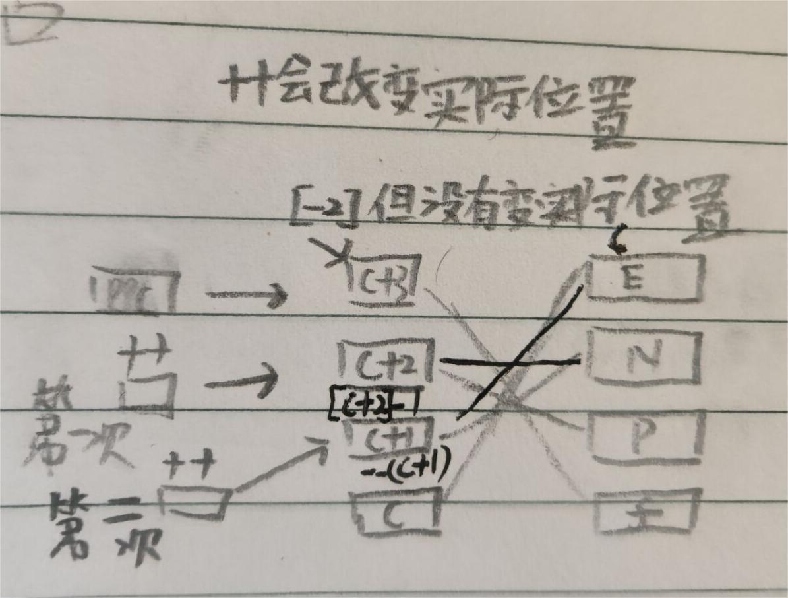

# 指针面试例题

## 例题1

```c
    int arr[] = { 1,2,3,4 };
    printf("%d\n", sizeof(arr));// 16
    printf("%d\n", sizeof(arr + 0));// 4/8
    printf("%d\n", sizeof(*arr));// 4
    printf("%d\n", sizeof(arr + 1));// 4/8
    printf("%d\n", sizeof(arr[1]));// 4
    printf("%d\n", sizeof(&arr));// 4/8
    printf("%d\n", sizeof(*&arr));// 16
    //尽管&arr + 1跳过了整个数组但它还是一个指针
    printf("%d\n", sizeof(&arr + 1));// 4/8
    printf("%d\n", sizeof(&arr[0]));// 4/8
    printf("%d\n", sizeof(&arr[0] + 1));// 4/8
```

---

## 例题2

```c
    char arr[] = "abcdef";
    printf("%d\n", sizeof(arr));// 7 当参数只为数组名时,计算的是整个数组
    //这里arr就不是计算整个数组了
    printf("%d\n", sizeof(arr + 0));// 4/8 因为是一个指针
    printf("%d\n", sizeof(*arr));// 1
    printf("%d\n", sizeof(arr[1]));// 1
    printf("%d\n", sizeof(&arr));// 4/8 取地址所以是一个指针
    printf("%d\n", sizeof(&arr + 1));// 4/8
    printf("%d\n", sizeof(&arr[0] + 1));// 4/8
```

> [关于`sizeiof`的细节请参考C语言学习`sizeof`](../C语言学习.md#sizeof)

---

## 例题3

```c
    char arr[] = "abcdef";
    printf("%d\n", strlen(arr));// 6
    printf("%d\n", strlen(arr + 0));// 6
    //读取位置 0x00000061 时发生访问冲突. *arr = a而strlen('a')
    //这是strlen会把'a'的ASCLL码值当成地址,然后向后找'\0'
    //而 0x00000061==转十==> 97所以报错访问冲突
    printf("%d\n", strlen(*arr));// error
    printf("%d\n", strlen(arr[1]));//error 与上述错误一致
    //虽然&arr这个数组指针作为参数,但是strlen还是用const char*接收
    //所以内部在使用地址++时,还是访问1个字节
    printf("%d\n", strlen(&arr));// 6 + warning
    //&arr + 1是在数组的最后面,那么找'\0'就是随机数了
    printf("%d\n", strlen(&arr + 1));// random + warning
    printf("%d\n", strlen(&arr[0] + 1));// 5
```

> [关于`strlen`的细节请参考C语言学习](../C语言学习.md#strlen-1)

---

## 例题4

```c
    char* p = "abcdef";
    //`sizeof`计算数组时计算的是数组的大小,而不在乎是不是`\0`
    printf("%d\n", sizeof(p));// 4 
    printf("%d\n", sizeof(p + 1));// 4/8
    printf("%d\n", sizeof(*p));// 1
    printf("%d\n", sizeof(p[0]));// 1
    printf("%d\n", sizeof(&p));// 4/8
    printf("%d\n", sizeof(&p + 1));// 4/8
    printf("%d\n", sizeof(&p[0] + 1));// 4/8
```

---

## 例题5

```c
    char* p = "abcdef";
    printf("%d\n", strlen(p));// 6
    printf("%d\n", strlen(p + 1));// 5
    printf("%d\n", strlen(*p));// err 相当于strlen('a')与例题3错误一致
    printf("%d\n", strlen(p[0]));// err
    //因为&p是一个二级指针,从他的后面找\0所以是随机
    printf("%d\n", strlen(&p));// random + warning
    printf("%d\n", strlen(&p + 1));// random + warning
    printf("%d\n", strlen(&p[0] + 1));// 5
```

---

## 例题6

```c
    int a[3][4] = { 0 };
    printf("%d\n", sizeof(a));// 48
    printf("%d\n", sizeof(a[0][0]));// 4
    printf("%d\n", sizeof(a[0]));// 16
    printf("%d\n", sizeof(a[0] + 1));// 4/8 -- 第一行数组首元素地址+1
    printf("%d\n", sizeof(*(a[0] + 1)));// 4
    printf("%d\n", sizeof(a + 1));// 4/8
    printf("%d\n", sizeof(*(a + 1)));// 16
    printf("%d\n", sizeof(&a[0] + 1));// 4/8 --第一行数组的地址+1
    printf("%d\n", sizeof(*(&a[0] + 1)));// 16
    printf("%d\n", sizeof(*a));// 16
    //虽然a[3]访问越界,但是sizeof的参数不参与运算所以a[3]就和a[0]是一样的
    printf("%d\n", sizeof(a[3]));// 16
```

---

## 地狱级难度指针

> 提示: ++会改变原先的值

```c
int main() {
    char* c[] = { "ENTER", "NEW", "POINT", "FIRST" };
    char** pc[] = {c + 3, c + 2, c + 1, c};
    char*** ppc = pc;
    printf("%s\n", **++ppc);
    printf("%s\n", *--*++ppc + 3);
    printf("%s\n", *ppc[-2] + 3);
    printf("%s\n", ppc[-1][-1] + 1);

    return 0;
}
```



> **第一题**: 先++ppc的实际位置已经改变(对应图解第一次), 这是指向`c+2`解引用得到`c+2`的地址, 再次解引用
> 得到P的地址,然后%s打印.结果为: `POINT`
>
> **第二题**: `*--*++ppc + 3`中+的优先级很低,所以先计算`*--*++ppc`,++ppc的实际
> 位置又一次改变(对应图解第二次), `*`解引用得到`c+1`, 这时`--`就等于`--(c+1)`
> 所以这时原来`c+1`位置的指针重新指向了`c+0`也就是`E`的位置, 然后`*`解引用得到
> `E`然后+3打印结果为`ER`
>
> **第三题**: `*ppc[-2] = *(*(ppc - 2))`偏移-2解引用得到`F`, 然后+3
> 打印结果为: `ST` 
>> 第三题注意点: ++才会改变原本来的值,+1不会(不重新赋值的情况下)
>
> **第四题**: `ppc[-1][-1] = *(*(ppc - 1) -1)`, `*(ppc - 1)`得到`c+2`,
> 而`(c+2)-1`这时原来的指针现在指向`c+1`也就是`N`,最后再+1,结果为:`EW`


