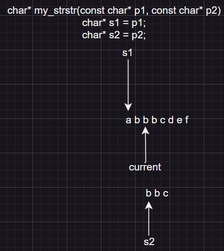

# string.h

## strlen()

### 指针版

```c
    size_t strlen(char* str) {
        int count = 0;
        while(*str++) {
            count++;
        }
        return count;
    }
```

### 递归

```c
    int m_strlen(char arr[])
    {
        if(*(arr) != '\0')
            return 1 + m_strlen(++arr);
        return 0;
    }
```

---

## strcpy()

```c
    char* my_strcpy(char* dest, const char* src) {
        char* result = dest;
        while(*dest++ = *src++);
        return result;//需预防NULL指针和越界问题need to prevent NULL points
    }
```

---

## strcat()

```c
    char* my_strcat(char* dest, const char* src) {
        char* result = dest;
        while(*dest != '\0') {
            dest++;
        }
        while(*dest++ = *src++);
        return result;
    }
```

---

## strcmp()

```c
    //在vs编译器下strcmp返回值为-1, 0, 1
    int my_strcmp(const char* str1, const char* str2)
    {
        while (*str1 == *str2)
        {
            if (*str1 == '\0')
                return 0;
            str1++;
            str2++;
        }
        if (*str1 > *str2)
            return 1;
        else
            return -1;
        }
```

---

## strncpy()

```c
    char* my_strncpy(char* dest, const char* src, int count)
    {
        char* result = dest;
        int len = strlen(src) + 1;
        for (int i = 1; i <= count; i++)
        {
            if (i > len)
            {
                *dest++ = 0;
            }
            else
            {
                *dest++ = *src++;
            }
        }
        return result;
    }
```

---

## strncmp()

```c
    //待整改
    int my_strncmp(const char* str1, const char* str2, size_t n)
    {
        for (int i = 0; i < n; i++)
        {
            if (*str1 == *str2)
            {
                str1++;
                str2++;
            }
            else
            {
                if (*str1 > *str2)
                    return 1;
                else
                    return -1;
            }
        }
        return 0;
    }
```

---

## strstr()

```c
    char* my_strstr(const char* p1, const char* p2)
    {
        assert(p1 != NULL);
        assert(p2 != NULL);
        //直接操作p1和p2指针容易没有回头路
        char* s1 = NULL;
        char* s2 = NULL;
        char* cur = (char*)p1;
        //如果p2为空字符串则直接返回p1的指针
        if (*p2 == '\0')
            return (char*)p1;
        /* s1和s2指针对比查找时不一定能完全匹配, 所以在没有完全匹配时,cur指针
           会停留在...  */
        while (*cur)
        {
            char* s2 = (char*)p2;
            char* s1 = cur;
            //while (*s2 && *s1 && !(*s1 - *s2))
            while (*s2 != '\0' && *s1 != '\0' && *s1 == *s2)
            {
                s1++;
                s2++;
            }
            if (*s2 == '\0')
            {
                return cur;
            }
            if (*s1 == '\0')
            {
                return NULL;
            }
            cur++;
            //当cur++后的长度小于s2时, 直接返回NULL
        }
        return NULL;
    }
```



---

## memcpy()

```c
    void* my_memcpy(void* dest, const void* src, size_t num)
    {
        char* result = dest;
        //int i = 0;
        //for (i = 0; i < num; i++)
        //{
        // *((char*)result)++ = *((char*)src)++;
        //}
        while (num--)
        {
            *((char*)result)++ = *((char*)src)++;// 需要注意优先级的问题
        }
        return dest;
}
```

---

## memmove()

```c
    void* my_memmove(void* dest, const void* src, size_t count)
    {
        assert(dest != NULL);
        assert(src != NULL);
        char* result = dest;
        if (dest < src)
        {
            //前 --> 后
            int i = 0;
            for (i = 0; i < count; i++)
            {
                *((char*)result)++ = *((char*)src)++;
            }
        }
        else
        {
            //后 --> 前 --- (char*)dest + count不是最后一个元素(字节);
            //  (char*)dest + count - 1才是最后一个元素位置
            while (count--)
            {
                //count--后在+count就是元素的准确位置
                *((char*)result + count) = *((char*)src + count);
            }

        }
        return dest;
    }
```

---

# stdlib.h

## qsort()

```c
    void my_qsort(void* base, int num, int size, int (*compare)(const void* a, const void* b))
    {
        int i = 0;
        int offset = 0;
        for (i = 0; i < num - 1; i++)
        {
            int j = 0;
            for (j = 1; j < num - offset; j++)
            {
                if (compare((char*)base + size * (j - 1), (char*)base + size * j) > 0)
                {
                    move((char*)base + size * (j - 1), (char*)base + size * j, size);//交换
                }
            }
            offset++;
        }
    }
```