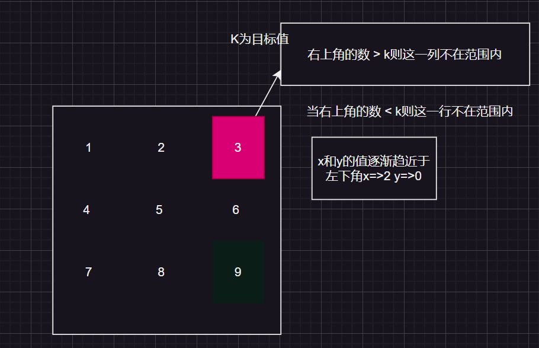

## my_strlen

- 实现字符串长度 - 递归版

```c
int my_strlen(char ch[])
{
	// int count = 0;
	/*while (*(ch++) != '\0')
	{
		count++;
	};*/
	if (*(ch) != '\0')
	{
		return 1 + my_strlen(++ch);
	}
	return 0;
}
```

- 实现字符串长度 - 指针版

```c
my_strlen(char* pc)
{
	int count = 0;
	while (*pc != '\0')
	{
		count++;
		pc++;
	}
	return count;
}
```

## 打印奇偶二进制位

```c
	void print_binary(int binary)
	{
		//奇数位
		for (int i = 30; i >= 0; i -= 2)
		{
			//与1按位与，不是0就是1，如果右移之后的个位数是1则返回值为1，为0则返回0
			printf("%d ", (binary >> i) & 1);
		}
		printf("\n");
		//偶数位
		for (int j = 31; j > 0; j -= 2)
		{
			printf("%d ", (binary >> j) & 1);
		}
	}
```

## 翻转字符串 - 递归版

```c
	/*
		左右两边翻转 - 两边进位再次递归
	*/
void reverse_string(char ch[])
{
	// ++需慎用，特别是在递归中(因为++会影响原来的值)，如果只是程序走一遍在末尾使用++操作符那就没什么大不了
	char tmp = ch[0];
	int len = my_strlen(ch);
	ch[0] = ch[len - 1];
	ch[len - 1] = '\0';
	if(my_strlen(ch + 1) >= 2)
		reverse_string(ch + 1);
	ch[len - 1] = tmp;
}
void reverse_string(char ch[])
{
	//保存第一个元素
	char tmp = ch[0];
	int len = my_strlen(ch) - 1;// 获得访问最后一个元素下标位置
	ch[0] = ch[len];
	ch[len] = '\0';
	//(ch + 1)第二个元素的位置
	if (my_strlen(ch + 1) >= 2)
		reverse_string(ch + 1);
	ch[len] = tmp;
}
```

---

## 字符串copy

```c
/*
	字符串拷贝.const char* 意味着指针指向的元素的类型为 const char
	之所以这么做是防止在编写这个函数的时候搞混参数
*/
char* my_strcpy(char* dist, const char* src)
{
	char* result = dist;
	//缺点就是发生错误时规避错误
	//if (dist == NULL || src == NULL) return;
		assert(dist != NULL);
		assert(src != NULL);
	while (*(dist++) = *(src++))
	{
		;
	}
	//等于'\0'时执行的操作
	//*dist = *src;

	return result;
}
```	

---

## 通过冒泡排序

```c
void swap(char* a, char* b, int width)
{
	int i = 0;
	for (i = 0; i < width; i++)
	{
		char tmp = *a;
		*a = *b;
		*b = tmp;
		a++;
		b++;
	}
}

void bubble_qsort(void* base, int number, int size, int (*compare)(const void*, const void*))
{
	int i = 0;
	for (i = 0; i < number - 1; i++)
	{
		int j = 0;
		for (j = 0; j < number - 1 - i; j++)
		{
			//因为void*没有访问字节的权限,为了实现通用效果,在内部强转为char*
			//这样在通过传递而来的size实现偏移拿到数据地址,而在compare函数
			//使用者通过强制类型转换来决定访问多少字节
			if (compare((char*)base + size * j, (char*)base + size * (j + 1)) > 0)
			{
				swap((char*)base + size * j, (char*)base + size * (j + 1), size);
			}
		}
	}
}
```

---

## 打印星星

```c
void star() {
	int line = 0;
	int blank = 0;//空格间距
	int star = 0;//**间距
	scanf("%d", &line);
	//上部分
	for (int i = 0; i < line; i++)
	{
		for (int j = line - 1; j > 0 + blank; j--)
		{
			printf(" ");
		}
		for (int n = 0; n < 1 + star; n++)
		{
			printf("*");
		}
		printf("\n");
		blank++;
		star += 2;
	}
	//下部分
	blank = 0;
	star = 0;
	for (int i = 0; i < line - 1; i++)
	{
		for (int n = 0; n < 1 + blank; n++)
		{
			printf(" ");
		}
		for (int j = 2 * line - 1 - 2; j > 0 + star; j--)
		{
			printf("*");
		}
		printf("\n");
		blank++;
		star += 2;

	}
};
```

---

## 杨氏排序

```c
int find_num(int arr[3][3], int target, int col, int row)
{
	int x = 0;
	int y = col - 1;
	while (x <= col - 1 && y >= 0)
	{
		if (arr[x][y] > target)
		{
			y--;
		}
		else if (arr[x][y] < target)
		{
			x++;
		}
		else
		{
			return 1;
		}
	}

	return 0;
}
```

> target的位置要么是右上角, 要么是左下角. 它们的共同特点是在一列或一行中
>
> 最大或最小



---

## 杨辉三角

```c
/*
1
1 1
1 2 1
1 3 3 1
1 4 6 4 1
*/
/*
	一行中的第0列和最后一列一定是 1 ---> 了解这一点后可得知其他的数: arr[i][j] = arr[i - 1][j] + arr[i - 1][j - 1]
*/
void printPascalTriangle(int n)
{
	int i = 0;
	int arr[5][5] = { 0 };
	for (i = 0; i < n; i++)
	{
		int j = 0;
		//每n列有n个数, 所以j可以等于i
		for (j = 0; j <= i; j++)
		{
			//第0列和最后一列复制为1
			if (0 == j || i == j)
			{
				arr[i][j] = 1;
			}
			else
			{
				arr[i][j] = arr[i - 1][j] + arr[i - 1][j - 1];
			}
		}
	}
}
```

---

## 素数

```c
//1 - 100之间
void isPrime()
{
	//首先偶数一定不是素数
	for (int i = 3; i < 100; i += 2)
	{
		int j = 0;
		for (j = 2; j < i; j++)
		{
			if (i % j == 0)
			{
				break;
			}
		}
		if (j == i)
		{
			printf("%d ", i);
		}
	}
}
```

---

## 阶乘

计算阶乘相加的结果

```c
//计算阶乘
int fn(int sum, int end)
{
	int num = 0;
	for (int i = sum; i <= end; i++)
	{
		int tmp = 1;
		for (int j = i; j > 0; j--)
		{
			tmp *= j;
		}
		num += tmp;
	}
	return num;
}
```

## 斐波那契数

```c
//斐波那契数
int fibonacci(int n) {

	// 基本情况：斐波那契数列的前两个数为0和1

	if (n == 0) {

		return 0;

	}
	else if (n == 1) {

		return 1;

	}

	// 递归调用，计算第n个斐波那契数的值

	return fibonacci(n - 1) + fibonacci(n - 2);

}
```